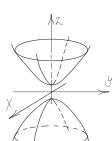

# **FOUR-DIMENSIONAL INTERFACE: SPACETIME**

## **Table of Contents:**

### **Introduction.**

### **Technical Preface.**

**Chapter I** - Reality as an Interface and Not as a Fundamental Structure.

**Chapter II** - The Fourth Dimension - Time as the Refresh Rate of Three-Dimensional Frames/Images/Moments in Motion Within the Four-Dimensional Interface.

**Chapter III** - Granular Universe - Elementary Particles Are Field Excitations That Extend Throughout Space and Can Function as "Lit Pixels" in a Screen Structure.

**Chapter IV** - Fitting the Four-Dimensional Interface into the Holographic Principle Theory.

**Chapter V** - Proposal for a Reinterpretation of Schrödinger's Paradox Through the Lens of the Rendered Interface Hypothesis.

**Chapter VI** - Gravity as a Consistency Algorithm: Spacetime as a Rendering Interface.

**Chapter VII** - The Black Hole as a Resource Management Mechanism in an Emergent Spatiotemporal Interface.

**Chapter VIII** - Large-Scale Optimization and the Phenomenon of Dark Matter as Low-Fidelity Rendering (LOD).

**Chapter IX** - The Unification of General Relativity and Quantum Mechanics Through the Model of Spacetime as an Emergent Four-Dimensional Interface of a Fundamental Structure.

**Chapter X** - If This Universe Is Emergent from a Structure Analogous to a Screen - The Big Bang Is the Initial Boot, the "Start" Button of the Interface.

**Chapter XI** - The Technology of Transistors and Silicon Chips and Their Cosmic Equivalence to an Analogous Supertechnology - Energy Trapped in a Two-Dimensional Structure and the Holographic Principle.

**Chapter XII** - Plasma Technology - Shaping Three-Dimensional Images with Mass and Volume in the Four-Dimensional Interface.

**Chapter XIII** - DNA - Technology for Rendering Animatable Avatars (Biotechnology) in the Four-Dimensional Interface.

**Chapter XIV - Interface Realism - Donald Hoffman.**

**Chapter XV - The Phenomenon of Dreams, Memories, and Imagination - In What Space Do They Occur And How Does This Connect With the Four-Dimensional Interface Theory?**

**Chapter XVI - Consciousness May Be The Energy Itself Trapped In The Two-Dimensional Structure of a Supertechnology - or Be Plugged Into This Interface By Electrical Current.**

**Final Conclusion - Technology is Not a Product of Human Evolution, But Precedes The Existence of The Universe Itself.**

**Experiments That Can Prove the Theory of This Book.**

## INTRODUCTION.

EUREKA!!! I truly feel that this is a moment of union for all of us — scientists, physicists, philosophers, professors, students, and aspirants of the Cosmos — because I am confident in saying that the pages of this book deserve a place of attention, investigation, analysis, testing, and an inevitable sense of "Eureka." I never imagined that I would reconcile General Relativity and Quantum Mechanics, but this is exactly the kind of thing destined to happen to me, an independent researcher of science and physics who cannot be stifled by an "academic fear" of being ridiculed by institutions and their "absolute truths." In other words, I do not have an "academic reputation" to uphold; therefore, this fear cannot control me as it controls great minds who already understand what this book will explain but do not have the courage to speak in these terms. It is important to note that there is a reason for this resistance: healthy skepticism. If science accepted every new idea without testing it exhaustively, knowledge would be chaos. However, let us not forget that Einstein himself stated that "I never made one of my discoveries through the process of rational thinking," and this is exactly the principle that brought me here and that will help you, the reader, the scientific community, and all aspirants to a "Theory of Everything" to understand this book and finally discover that the truth was right under our noses the entire time. Before we embark on a journey through the unification of General Relativity and Quantum Mechanics by understanding that Spacetime functions as a four-dimensional interface emergent from a "granular/pixelated screen structure" (transcendent supertechnology), it is necessary to consider that technology is not something artificial in the opposite sense of nature; it is nature itself understanding itself through the human being. All technology—from silicon computers to cellular bioelectricity—already exists in nature, which is itself a functional and absolute technology. Our human concepts of what "technology" is and the names we have given to our discoveries are merely symbols that help us interpret phenomena. However, it does not mean that these phenomena are exclusive within these concepts; for example, just because we developed a "computer" does not mean that this idea, or something equivalent to it,

but on a colossal scale that transcends our minds, could not have already been created, being precisely the possible cause for the development of a universe such as this one. Our concepts of what "technology" is and the names we attribute to our discoveries are, ultimately, only linguistic symbols. When we pronounce words like "electricity," "atom," or "silicon," we are not describing the ultimate essence of reality, but rather creating labels for phenomena that we manage to isolate and measure. The fact that we have developed something we call a "computer"—a data processing machine based on semiconductors—frequently causes us to fall into the error of believing that computation is a human exclusivity. However, the phenomenon of "processing information" is not exclusive to our concept of a case and wires; nature was already "computing" the position of stars and DNA replication billions of years before Turing. What we call a computer is merely our local instance of a universal principle of data processing. It is not because our technology has a certain form that the fundamental idea behind it cannot exist on a colossal scale, transcending the limits of our imagination. If we observe that the universe operates under strict mathematical rules, that it possesses processing limits (speed of light) and minimum units of information (Planck scale), it becomes logically viable to suppose that the Universe itself is the result of a transcendental processing architecture. In this scenario, the "computer" that gave rise to our spacetime would not look like anything we could hold in our hands; it would be a structure of higher dimensions, where the substance is not silicon, but consciousness itself or a form of pure energy that we have not yet named. Our universe would be, therefore, the "output" of a calculation executed by this colossal intelligence. Technology as a Mirror of Nature: We did not invent the concept of a "network"; we only symbolized it through the Internet by observing how the brain and ecosystems behave. We did not invent "data storage"; we only mimicked it in chips by observing the persistence of information in the universe. This leads us to a profound reflection: if our technology is a mirror of natural laws, the fact that we are creating virtual worlds and artificial intelligences today may be the clearest sign that we ourselves are the product of an analogous process happening on a colossal scale. Through this vision, we will embark on an investigation of physical laws and how they may be the fruit of a

possible "supertechnology," through analogies and comparisons with our own technological discoveries.

**TECHNICAL PREFACE.**  
**THE ARCHITECTURE OF RELATIONAL HARDWARE.**

RECONCILING QUANTUM GRANULARITY WITH GENERAL RELATIVITY - OVERCOMING THE LORENTZ INVARIANCE CONFLICT THROUGH EMERGENT GEOMETRY:

For the Four-Dimensional Interface hypothesis to be fully understood in its entirety, it is necessary to resolve an apparent conflict with 20th-century physics: Lorentz Invariance. Conservative scientists may question how a "pixelated" or granulated universe can appear the same in all directions (isotropy) without presenting a preferred direction in the grid. This book proposes that the conflict is resolved through Background Independence and the relational nature of the system.

1. The Screen as a Logical Addressing Matrix: The Hardware of this universe is not a rigid Cartesian monitor (like a grid of pixels on a television). As proposed in Loop Quantum Gravity (LQG), the fundamental structure is a Spin Network:

- Relational Pixels: "Planck pixels" do not have an absolute position; they are space itself.

- Memory Addressing: The Hardware functions like a data server where "distance" is defined by the density of logical connections (entanglement), rather than a fixed geographical layout.

The area of this "screen" is not continuous, but quantized according to the area operator:

$$A(s) = 8\pi l_p \wedge^2 \sum_i \sqrt{j_i} (j_i + 1)]$$

This granularity ensures that the Hardware remains discrete and computable (Quantum Physics), while the Interface remains fluid (Relativity).

2. The Software as the Guarantor of the Constancy of "c": Lorentz Invariance is not a limitation of the screen, but a rule of the Rendering Engine. The speed of light (c) is redefined as the maximum data update rate between nodes of the quantum network. To maintain consistency between different observers, the system applies the Lorentz Factor ( $\gamma$ ) as a processing load adjustment in the Interface:

$$\gamma = 1 / \sqrt{[1 - v^2/c^2]}$$

Thus, length contraction and time dilation are not hardware deformations, but LOD (Level of Detail) mechanisms and buffer management to maintain network synchrony.

3. Architectural Conclusion: By separating the Static Infrastructure (Quantum Hardware) from the Dynamic Phenomenon (Relativistic Interface), we unify the two greatest theories of physics. The hardware provides the information pixels; the software provides geometry and gravity. What we call reality is the meeting point where quantum data becomes an observable phenomenon through continuous rendering.

## CHAPTER I

### REALITY AS AN INTERFACE AND NOT AS A FUNDAMENTAL STRUCTURE.

This scientific research aims to discuss the hypothesis that spacetime, and consequently gravity, are not the ultimate fundamental reality but rather an emergent result of a structure analogous to a screen that projects three-dimensional space moved by time (4th Dimension) as the frame rate of a four-dimensional interface. In this interface, the complexity of minimally conscious life allows for the animation of 3D images that, although they appear solid, are essentially composed of billions of energy cycles. Understanding this will imply a chain reaction that will affect how we interpret everything we have discovered about the macro world (relativity) and the micro world (quantum physics), changing physics forever. Many loose ends can be reconciled, such as the Measurement Problem: quantum mechanics states that a particle is in several states at the same time (superposition); however, when there is an interaction, we see only one state. This would not be a problem if we understood quantum field excitation (a particle) as an event analogous to the lighting of a pixel on a screen to render images. Just as a pixel only lights up in a defined position at the moment of image projection, yet can be lit anywhere across the full extent of the screen, a particle only collapses into a defined position when there is an observation/interaction of a moment in spacetime (quantum excitation = lit pixel). Since quantum excitations can occur anywhere throughout the fabric of space (interface/screen), this explains the probabilistic nature of the particle. This mechanism would be analogous to digital animation rendering, like a three-dimensional movie or an advanced computer game that we play (live) in the first person (supertechnology/transcendent). In other words, the transistor technology "discovered and developed" by us — the intelligent organization of images rendered on a screen — may be a micro-model of the technology that precedes the universe itself, something transcendent to the third and fourth dimensions, just as we create two-dimensional technologies (computers and cell phones).

If we can prove that spacetime is the interface of a structure analogous to a "digital screen," there would be a paradigm shift in physics; spacetime would cease to be the "fundamental stage"

and would become an emergent phenomenon. This would unify two ideas that are currently separate: general relativity (geometric) and quantum mechanics (informational). The greatest open problem in physics today is unifying general relativity with quantum mechanics, but if spacetime is emergent, gravity would not need to be quantized directly; it would arise as a collective effect of the underlying structure (just as elasticity arises from atoms). This would enable us to resolve paradoxes such as:

* Singularities (black holes, Big Bang).

* Mathematical infinities.

* Explaining why gravity is so weak.

* Understanding the origin of the geometry of the universe.

In the case of black holes, the information paradox could be resolved, as the event horizon would be like a resolution limit of the “screen,” and entropy would become a count of the fundamental states of the structure. The Big Bang would cease to be a singularity and would become a phase transition, like when a screen turns on or when the system begins to “render” the interface (spacetime). A theory of emergent spacetime could lead to new types of physical computation, control of geometric states (gravity as an emergent effect), technologies based on fundamental information, and extremely precise sensors of the fabric of space. If it were proven that spacetime is emergent from a screen-like structure, this would:

* Redefine what is “real.”

* Resolve the greatest problem of modern physics (unifying relativity and quantum mechanics).

* Unify geometry, information, and quantum mechanics.

* Open up new experimental predictions.

* Create technologies that are unimaginable today.

It would be one of the greatest discoveries in human history; therefore, I invite you to embark with me in this book on an exploration and analysis of all the evidence that can lead us to this conclusion.

## **INTERLINKING THE EVIDENCE INVESTIGATED THROUGHOUT THE CHAPTERS:**

Uniting ideas such as Loop Quantum Gravity, the Holographic Principle, Interface Realism, and observing transistor technology, in this book, we will break down the evidence of spacetime functioning as a four-dimensional interface being projected onto a screen-like structure — a possible supertechnology that transcends the 3D universe. Through this perspective, we can finally reconcile Quantum Mechanics and General Relativity if we consider both spacetime and gravity as emergent phenomena from a fundamental structure instead of considering them the substantial reality itself. For Relativity, the fabric of Spacetime is infinitely smooth, a continuous and dynamic surface in which there is movement and curvature (rendered interface), while for Quantum Mechanics: Space is a static and pixelated stage (screen structure). Here, the solution of Spacetime as an emergent interface reveals that the physics of the Infrastructure (screen) cannot be the same as the physics of the Phenomenon (interface) — a concept that will be explored in Chapter V of this book. As a consequence of this equation, gravity could function as a software program that is organizing and compacting three-dimensional information, like a convergence force that maintains the cohesion of the universal structure, acting as a data compressor, keeping particles, atoms, and molecules together without falling apart — like a code that organizes the informational system we experience as matter.

The big problem for physics in reconciling quantum theory and general relativity lies in the fact that we cannot quantize gravity; that is, since particles do not have a defined position in space, their curvature does not influence the three-dimensional fabric like large bodies do. Therefore, the idea that gravity is caused by the curvature of spacetime, as in general relativity, does not work. However, imagine that the quantum excitations we call particles function like pixels lighting up on a "screen structure" where three-dimensional images are rendered. This would explain the double-slit experiment, wave/particle duality, and the probabilistic superposition demonstrated by Schrödinger's Cat, because all these quantum phenomena indicate a behavior analogous to the functioning of

digital rendering, where pixels are lit in specific locations on the screen to form images, and can be lit across the entire extent of the screen on demand — that is, according to the coordinates of a certain image in a given frame. Just as particles (excitation of quantum fields) can appear throughout the extent of spacetime, not having a defined position as long as there is no interaction or measurement, collapsing into a position only on demand — that is, when there is an observer or interaction with a given moment in time (there will be an entire chapter on the analogy of pixels and particles — Chapter III).

From this view, we understand why gravity does not have a "same-level" interaction with quantum particles, because just as the gravity programming of a video game (software) has no direct influence as a mechanical or geometric force on the pixels of the monitor screen (hardware), since the pixels are part of the structure where the game's graphics system renders the images. In other words, the programming of gravity exerted on the logical elements of the game cannot directly touch the level of the structure on which the game is running. Since the game interface is emergent and not the structure itself, the gravity software does not "touch" the pixels because its programming/action lives in the world of pure logic. If spacetime is an emergent interface of a screen structure, gravity may be a programming of three-dimensional holography, and therefore it is not an intrinsic property of the quantum world, but rather a geometric restriction imposed by the interface (software) and does not have a direct interaction at the level of particles (field excitations) that are part of the fundamental structure (hardware). Wanting gravity to work at the particle level is the same as wanting a game's software program to directly influence the pixels on a screen without going through binary coding.

The idea of a granular universal fabric and scientific theories that propose the three-dimensional fabric as a pixelated screen have already been created, such as Carlo Rovelli's Loop Quantum Gravity, for example, which proposes that spacetime is a granular fabric formed by pixels of space. These "grains" of space are incredibly small, on the order of the Planck scale, and form a spin network composed of nodes and edges like a dynamic mesh, where each node and each link carries a quantum number like the qudits of quantum computing. Gravity is the result of the reorganization of this network; when a mass is present, the local spin network distorts.

Three-dimensional space is smooth and continuous because the pixels are extremely small — the same effect we find in high-resolution digital images: up close you see pixels, from afar you see a continuous image. Particles can be a technology analogous to pixels, with zillions of them rendering three-dimensional images.

Another theory that describes the universe as a screen is Gerard 't Hooft's holographic principle, which proposes that all the information contained in a volume of space can be described by data encoded on its surface. The "interior" of the universe may be just a projection, and the real information would be stored on a 2D surface, just as a 2D hologram generates a 3D image. This idea arose because when you throw matter into a black hole, the information does not increase proportionally to its volume, but rather proportionally to the area of the event horizon. The maximum amount of information that can exist within a volume is proportional to the area that surrounds it, meaning the universe may function as a 3D/4D hologram emerging from data on a super-advanced 2D screen divided into discrete units of area also equivalent to Planck "pixels." Therefore, the fact that the increase in the volume of a black hole is proportional to the area around it may indicate that the universal fabric has a resolution limit with a finite number of bits per area, functioning like a screen with minimum pixels. In this view, pixelation would also be the fundamental structure of space, being the surface itself (screen) and not the objects rendered on it; that is, it is as if the pixels were the 2D hardware structure that is rendering the 3D/4D space software.

The theory of spacetime itself seems to describe the universe as a "three-dimensional film" animated by the fourth dimension, with space being the interface projected on the screen and time being the frame rate of playback for these moving images. In 1908, Einstein's professor, Hermann Minkowski, realized that all the equations of Special Relativity only became truly clear if space and time were combined into a single geometric fabric of 4 dimensions; that is, every piece of space is directly linked to the passage of time, being the only way to get from one point to another.

Each "footage of time" is what renders the 3D reality, like a block of cheese cut into several slices that together form its total figure. The passage of time between each slice is what causes the movement of three-dimensional "images" through space, as in a pixel art graphic animation: each frame of images is rendered in several frames per second, creating the sensation of animation. Relativity does with spacetime exactly what a video game graphics engine does with a setting: it adapts the "format" of time and space to the speed and state of the observer, as if the universe were a rendering engine that has fixed rules like the speed of light, adjusting what is "loaded" for each observer. In a game, the engine decides what to render; the setting only appears in the player's field of vision, and what is not on the screen exists "in potential" as stored data. In the universe, space and time configure themselves according to the speed of each observer; different observers have different "rates" of time and different "sizes" of distance. The engine only renders what you can access, and spacetime only manifests as you can interact with it.

The fact that space and time adjust to the observer's speed reinforces the idea of the universe being generated as a film being rendered at different frame rates; each observer traverses this film firsthand at a different speed. The speed at which you walk through space changes the speed at which your internal film passes; walking fast in space is like pressing "slow motion" on your personal film. If you put a video in slow motion, it passes more slowly, even if the scenery moved normally for the person who filmed it. In the universe, if you move fast in space, your time passes slowly, but the "film of the universe" remains normal for someone who is stationary. Your movement in space automatically activates an internal slow motion in your time; this is exactly what astronauts experience. The film is the same, but each character travels through the frames at different speeds. In a video game, LOD (Level of Detail) is responsible for reducing details of distant objects, zooming in on objects when you move fast, and decreasing apparent sizes to allow efficient rendering. In relativity, when moving fast, the distances in front of you contract; space literally "shrinks" in the direction of movement, as if the universe applied the same LOD principle to the geometry of spacetime. Further evidence of the universe functioning as a pixelated screen is dark matter, which permeates all visible bodies but neither emits nor reflects light, and even though we do not see or touch it, it has

gravity that interacts with all matter in the universe. Thinking of a computational system generating the universe, could dark matter be information analogous to the number 0 while visible matter is analogous to the number 1, as in binary code? Thus forming the visible three-dimensional images through the contrast between light and non-light, exactly as on a screen where darker pixels give shape to lighter and colored pixels, since dark matter is literally permeating all visible matter in the universe?

Given all these analogies, we can consider that gravity may be the software that architects and organizes the universe; without it, no living system would exist. Space would be a chaotic sea of loose particles without structure or organization; the most important sources of energy and chemical elements crucial for the existence of life, the stars, would simply not exist without gravity. Could gravity be the direct effect of a consciousness that is organizing matter like an artificial intelligence? It continues to join molecules and form stars and galaxies; the process of creation is still underway, and gravity seems to be the force behind this intelligent organization. For how is it possible that the same force that exerts the exact intensity to keep us in the planet's orbit without crushing us can keep colossal stars in the firmament without them scattering through space? How is it possible that this force keeps bodies orbiting one another without colliding? How is the configuration of planets rotating around stars the exact and precise system for the formation of life that experiences the illusion of day and night and the unfolding of tides and seasons caused specifically by the interaction between these bodies? How can this force we call gravity geometrically configure celestial bodies in space so that we can observe a pleasant sunset landscape and a full moon at a perfect and safe distance? Gravity is not a simple attraction of bodies or a curvature in spacetime; gravity is what keeps the universe and its small worlds (galaxies and solar systems) mathematically and geometrically coherent, being applied to matter in a very intelligent way. All these characteristics indicate the presence of precise mathematical calculations in the application of gravity according to the mass of the bodies, but who or what is doing these calculations? We can find this answer by considering gravity as a software program, and we must remember that as much as these terms are concepts used in human computing, the way technology works for us may be analogous to the way a superior,

advanced technology capable of creating a universe like ours works. This reminded me of an ancient Hermetic axiom: "That which is above is like that which is below, and that which is below is like that which is above...". Physicist Melvin Vopson published an article where he directly discusses gravity as an information compression system, "The Information Physics of the Universe." In this article, he proposes that information is the fifth fundamental state of matter and that all matter contains bits of information; gravity can be reinterpreted as a mechanism that minimizes, compacts, or "compresses" data in the general physical system. The universe would tend to reduce information because nature tends toward the state of lowest informational entropy, something similar to what we call data compression in computing. If the universe is a computational interface, gravity would be an algorithm that "pulls" scattered bits to organize them more efficiently; in the case of black holes, gravity reaches the maximum peak of information compression.

**CHAPTER II**  
**THE FOURTH DIMENSION - TIME AS THE REFRESH**  
**RATE OF THREE-DIMENSIONAL**  
**FRAMES/IMAGES/MOMENTS IN MOTION WITHIN**  
**THE FOUR-DIMENSIONAL INTERFACE.**

**TIME - THE FOURTH DIMENSION AS A RENDERING FRAME RATE:**

If the functioning of spacetime is analogous to the rendering of animated images on an emergent interface of a screen structure, space is the interface and time is the playback frame rate of the three-dimensional images, as in a digital animation where movement and scenery occur through the sequential updating of frames per second in different states over time in simulations and games. Three-dimensional time is not necessarily the mathematical measure we created to divide moments into minutes and seconds; in science, time is a measurable quantity to gauge duration and describe movement and change, relating events through equations, like a mechanism for transitioning images frame by frame (frame rate). In physics, the universe is formed by four dimensions of space: length, width, height, and a 4th dimension represented by time, which is the only way to go from one point to another in space, it being impossible to move without passing through it. It is impossible for a three-dimensional object to have height, width, and depth without these measurements being directly linked to time, since every centimeter of length of any space has a specific duration of time linked to its length. If an object is 30 cm long, its front and its back are separated by about 1 nanosecond of light; that is, the parts of the object are not just in different places, they are at different moments of the interface. For example, if you observe a box from all its angles, your eyes traverse the geometry of this box over a few seconds; this shows that time is intrinsically linked to the three dimensions of space, because otherwise you would observe this same box from only one angle, making space a static image — the movement of your eyes traversing the angles of the box cannot happen separately from time. This is how any geometry or movement through space occurs;

imagine this same box moving on a conveyor belt—each frame or instant of time along this belt represents a three-dimensional cross-section of the existence of this box, like a frame of a running film. This means that the 4th dimension is a composite of infinite slices of three-dimensional images, where all the geometric possibilities of spaces and movements possible to be rendered on the universal interface/screen (spacetime) are encoded; each image plane corresponds to a location in space at a particular moment in time, just as in a modern game it is possible to generate trillions of different images from mathematical and physical rules, calculating variables and states that are generated through assets (textures and 3D models). To understand this, think of the Speed of Light not as "light," but as the maximum speed of data transmission between two points of the universal screen.

* The "Giant Object" Example: Imagine a gigantic spaceship, 300,000 kilometers long (the distance light travels in 1 second).

* The Synchrony Problem: If you give a command for this ship to accelerate, the electrical (or physical) signal that leaves the engine at the rear takes a full 1 second to reach the nose of the ship.

* The "Time Slice": During this 1 second, the rear is already moving, but the nose is still stationary. For the interface of the universe, the "rear" is at Time 1, but the "nose" is still receiving the information from Time 0.

* Conclusion: An extensive object never exists in a single absolute "now." It is "spread out" across different update states of the graphics engine.

Why does this happen? (The HDMI Cable Analogy): Imagine you have a monitor so large that the HDMI cable takes a perceptible amount of time to carry the signal from the video card to the pixels at the top of the screen. The pixels at the bottom show the current frame (Frame 100). The pixels at the top are still showing the previous frame (Frame 99) because the information is still "traveling" through the cable. In the universe, the "cable speed" is the speed of light. Since nothing travels faster than that, the front of a galaxy is, literally, in a different "frame" of time than the back of the same galaxy relative to any observer. Physical objects are, in fact, data processes; if an object were a "solid" and "single" thing, it should move all at once. But physics shows that it moves as an "information wave."

This proves that the object is not a basic unit, but rather a set of assets being updated sequentially by the interface. The three-dimensionality of an object is an illusion of simultaneity. In fact, each atom of a body occupies a different coordinate in processing time. A "large" object is a sequence of interconnected frames; it is both a spatial structure and an extensive temporal structure. This explains why, in relativity, there are no perfect "rigid bodies." If you hit one end of an infinitely long iron bar, the other end does not move instantaneously. The "strike" needs to be rendered frame by frame along the length of the bar.

The theory of relativity strengthens the analogy of reality being generated frame by frame, since time is not absolute but relative to each observer; the movement of an observer changes their perception of time and distance. The faster you move, the more time slows down and space contracts for you, relative to objects at rest; that is, spacetime is like a relative and adaptable mesh capable of accelerating, dilating, or even pausing, as if each observer had their own "rendering configuration" of space and time. The speed at which you walk through space changes the speed at which the "three-dimensional film" is rendered for you; it is like pressing "slow motion" on your character's experience while the "universe film" remains normal for someone who is stationary, analogous to the experience of different characters playing an online video game at the same time, for example. Imagine three people watching the same movie, but one sees it at normal speed, another at 0.98x, and another at 0.5x; they are seeing the same content, but each one travels through the movie at a different rate. In the universe, everyone is on the same spacetime fabric, but each person travels through the "film of their own life" at a different rhythm depending on speed and gravity. If you traveled at the speed of light, it would be like putting the movie in "ultra-slow motion" mode; for you, time passes as normal (1 second is 1 second), but for others, your movement in space is almost frozen — in slow motion, like objects falling into a black hole where time dilates because of the extreme curvature of space. The speed of light would be the maximum update rate of the Four-Dimensional Interface, just as in a computer game engine there is a limit of frames per second to form movements and scenery; therefore, it is as if the speed of light defined how much space can be updated per frame, preventing temporal paradoxes and maintaining

the order of cause and effect. This is why light travels at 100% of the permitted speed in space; its movement in time is zero, it does not undergo a frame rate—it is like watching a movie with a playback rate = 0; there is no before or after, everything is instantaneous, and this describes a very peculiar behavior found only in the movement of light, which may indicate that space and time are illusions. Therefore, relativity can help us understand the analogy of spacetime as an animation rendered on a screen. Imagine a game character who:

- - Walks slowly -> their film runs at 24 FPS (normal)
- - Runs very fast -> their film runs at 12 FPS
- - Reaches the limit of frames per second -> their film reaches 0 FPS (frozen in time, speed of light)

It is exactly what happens in relativity:

- - High speed -> time slows down
- - Low speed -> time passes normally
- - Speed of light -> time stops.

SPACE = where the scenes happen (settings, positions, distances, angles).

TIME = how quickly you pass through these scenes (frequency of updates, fluidity of the experience).

So:

More movement in space = less speed in time (like reducing FPS to increase resolution or graphical load).

Less movement in space = more speed in time (like increasing FPS because the scene requires less processing).

Relativity would be the "graphics engine" of the universe, just as in a game:

- - The engine decides what to render, when, and with what detail.
- - The setting only appears in the player's field of vision.
- - What is not on the screen exists "in potential," stored.

In the universe:

- - Space and time configure themselves according to the speed of each observer.
- - Different observers have different "rates" of time and different "sizes" of distance.
- - What is not in your light cone cannot "appear" yet.
- - Just as the game only renders what you can access in a scene, spacetime only manifests as you can interact with it.

## HOW THE IDEA OF DIGITAL ANIMATION RENDERING CONNECTS WITH SPACETIME:

In a game, the scenery that appears depends on the character's movement. In real spacetime, the perceived time and space depend on the observer's movement. This allows for a profound analogy: rendering depends on movement and spacetime does too. In a game, the engine only renders (draws) the objects that are within your field of vision. By moving, you "unlock" new parts of the scenery. What is off-screen does not cease to exist, but is "hidden," stored, without being calculated in detail. In real spacetime, times and spaces are different, like different resolutions in a relative way, depending on the observer's movement. In a game, an object close to the player is rendered in high resolution, with more polygons, shadows, and textures. A distant object is rendered in low resolution or even removed. In spacetime, observers at different speeds experience different times and distances. This is not just perception; it is physical and measurable. It is as if the universe had a time rendering rate and a space rendering rate for each movement. Movement "redistributes" space and time (just as the game's GPU redistributes resources). Relativity does to spacetime exactly what a graphics engine does to a setting: it adapts the "format" of time and space to the speed and state of the observer. As if the universe were a rendering engine that has fixed rules (the speed of light), distributes the "budget" between space and time, and adjusts what is "loaded" for each observer.

### SPACE CONTRACTION AS DYNAMIC LEVEL OF DETAIL:

This occurs when a game reduces the details of distant objects, brings objects closer when you move fast, and decreases apparent sizes to allow for efficient rendering. In the theory of relativity, when moving fast, the distances in front of you contract; space literally "shrinks" in the direction of movement, as if the universe were applying LOD (LEVEL OF DETAIL) to the geometry of spacetime.

**SPEED OF LIGHT AS THE MAXIMUM FRAME RATE OF THE UNIVERSE:** In a computer game, the engine has a maximum FPS (frames per second); nothing in the system can calculate faster than this limit. In the universe, light is the maximum FPS of reality;